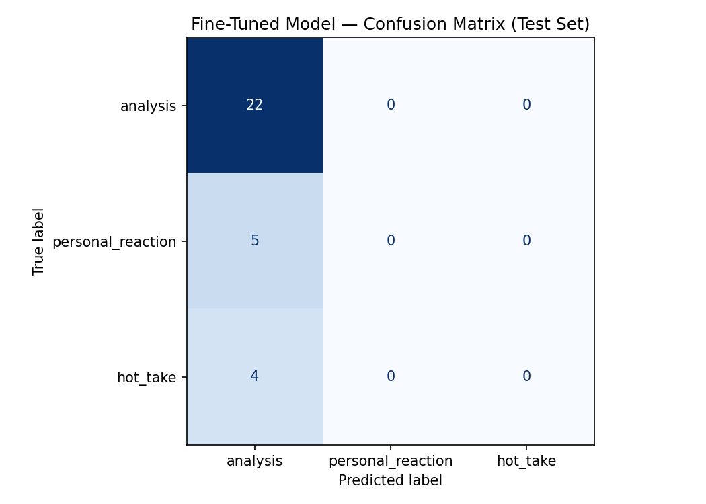

# TakeMeter

TakeMeter is a text classification project that categorizes posts from the Reddit community **r/LetsTalkMusic** into different discussion types using natural language processing. The project compares the performance of a zero-shot large language model (Groq Llama 3.3 70B) with a fine-tuned DistilBERT classifier trained on a manually labeled dataset.

---

# Project Goal

The goal of this project is to compare a zero-shot Llama 3.3 model accessed through the Groq API with a fine-tuned DistilBERT classifier to determine whether supervised training on a small, domain-specific dataset improves classification performance.

---

# Community

**Subreddit:** r/LetsTalkMusic

r/LetsTalkMusic is a discussion-based Reddit community where users share opinions, analyses, and personal experiences about artists, albums, genres, and the music industry. Unlike recommendation-focused communities, posts typically encourage thoughtful conversation and debate.

---

# Labels

The dataset contains three categories.

## analysis

Posts that explain an opinion using reasoning, comparisons, examples, or evidence.

**Example:**

> Kendrick Lamar's albums stand out because of their storytelling, lyrical depth, and consistent themes across each project.

---

## personal_reaction

Posts that mainly express personal feelings, memories, or preferences without providing detailed reasoning.

**Example:**

> I absolutely love this album. It always puts me in a good mood.

---

## hot_take

Posts that make strong or controversial opinions without meaningful evidence or explanation.

**Example:**

> The Beatles are the most overrated band ever.

---

# Dataset

* **Total examples:** 201
* **Source:** Manually labeled Reddit posts and comments from r/LetsTalkMusic

## Label Distribution

| Label             | Count |
| ----------------- | ----: |
| analysis          |   141 |
| personal_reaction |    32 |
| hot_take          |    28 |

The dataset was manually labeled to create supervised training data for the classifier.

The data was split using **70% training, 15% validation, and 15% testing** with stratified sampling to preserve the class distribution across all three datasets.

---

# Model

The fine-tuned classifier uses:

* DistilBERT (`distilbert-base-uncased`)
* Hugging Face Transformers
* PyTorch
* Scikit-learn

### Training Configuration

* Epochs: 3
* Learning Rate: 2e-5
* Batch Size: 16
* Weight Decay: 0.01

---

# Zero-Shot Baseline

The baseline classifier used:

* Groq API
* Llama 3.3 70B Versatile

The model received label definitions and examples through prompt engineering and classified each post without additional training.

### Baseline Accuracy

**67.7%**

---

# Fine-Tuned Results

After training DistilBERT on the manually labeled dataset:

### Fine-Tuned Accuracy

**71.0%**

### Improvement

**+3.2 percentage points** compared to the zero-shot baseline.

---

# Evaluation

Evaluation was performed on a held-out **test set of 31 examples**.

### Results Comparison

| Model                      |  Accuracy |
| -------------------------- | --------: |
| Zero-shot Groq (Llama 3.3) | **67.7%** |
| Fine-tuned DistilBERT      | **71.0%** |

## Confusion Matrix



The confusion matrix shows that the model correctly classified nearly every **analysis** example but struggled to distinguish **personal_reaction** and **hot_take** posts. This behavior is expected because the dataset is imbalanced:

* analysis: 141 examples
* personal_reaction: 32 examples
* hot_take: 28 examples

With a larger and more balanced dataset, the classifier would likely improve its ability to recognize the minority classes.

---

# Repository Contents

* `takemeter.ipynb` — Complete notebook
* `takemeter_dataset_200plus.csv` — Manually labeled dataset
* `planning.md` — Project planning and label definitions
* `evaluation_results.json` — Evaluation metrics
* `confusion_matrix.png` — Confusion matrix visualization

---

# How to Run

1. Clone the repository.

2. Install the required packages:

```bash
pip install transformers datasets torch scikit-learn pandas matplotlib groq
```

3. Open the notebook:

```bash
jupyter notebook takemeter.ipynb
```

or upload the notebook to Google Colab.

4. Add a valid Groq API key before running the zero-shot baseline.

5. Run the notebook from top to bottom.

---

# Future Improvements

Possible improvements include:

* Collect a larger labeled dataset.
* Balance the three classes.
* Experiment with larger transformer models.
* Tune additional hyperparameters.
* Apply data augmentation to improve minority-class performance.

---

# Conclusion

This project demonstrated that fine-tuning DistilBERT on a manually labeled dataset of Reddit music discussions improved classification accuracy from **67.7%** to **71.0%**, outperforming the zero-shot Groq baseline. Although the classifier favored the majority class because of the limited and imbalanced dataset, the results show that supervised fine-tuning can improve performance on a domain-specific text classification task.
